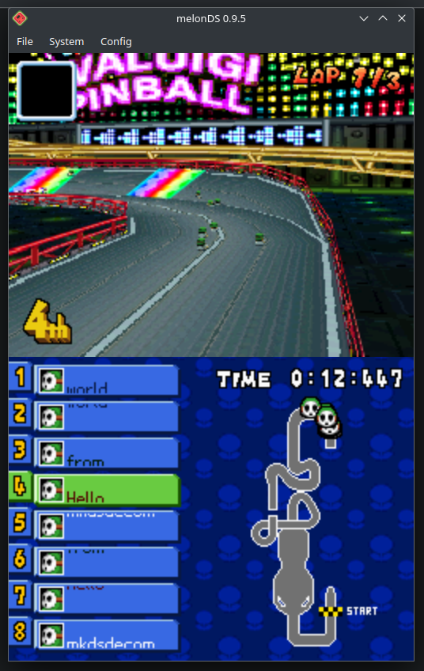
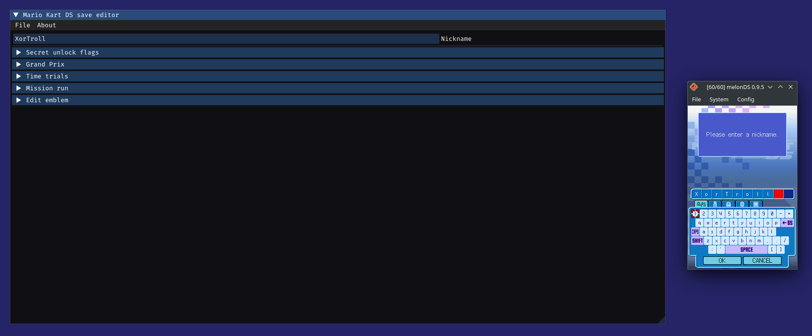
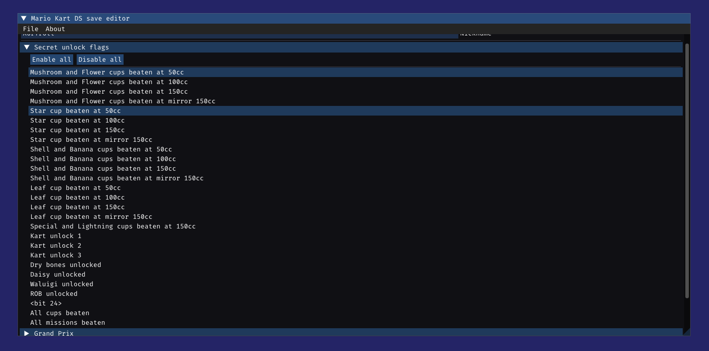
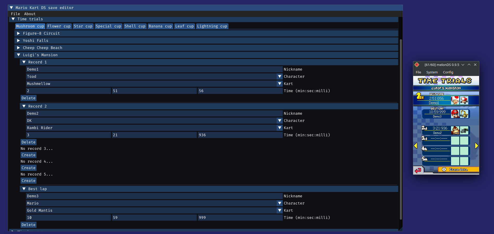
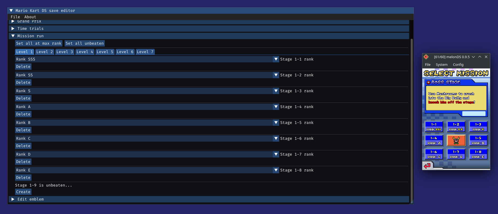

# mkdsdecomp

> A work-in-progress decompilation project of Mario Kart DS

While the obvious long-term goal of this project is to 100% document and understand MKDS, ASM hacking and the better understanding of yet not fully documented DS formats, specifications... are interesting short-term goals that motivate work on reversing this game.

## Decompilation progress

Progress can be tracked in some way by the generated [types header](include/mkds-decomp-types.h), [symbols header](include/mkds-decomp-syms.h) and [symbols](include/symbols.x), since all unknown types and functions are slowly being named and documented as they are better understood, and since I cannot just push my IDA database :P

## ASM hacking utilities

An [export script](export.py) is used to export current documented functions/enums/structs/global objects to the header and symbols mentioned above. This are conveniently generated so they can be directly used for [ASM hacking](asmhack-example) as a short-term usage for this reversing until the game is done ;)

## Save editor

Reversing save-data format and encryption/decryption allowed to create an almost fully-featured online Mario Kart DS savedata editor:

## Code reconstruction

As function logic gets fully documented, [libntr](libntr) serves as a (long-term) work-in-progress reimplementation of Nintendo's SDK code/libs, while [mkds](mkds) contains actual MKDS-specific code... as long as I'm able to tell them apart ;)

(These libraries are not really useful right now, and they might not even compile correctly as some stuff is only half-implemented)

Note that this is low priority, since different parts of the code can be really dependant on each other, as not much can reliably be done until several parts are (close to) fully understood

## Credits

- [GBATEK](https://problemkaputt.de/gbatek.htm) for its great (although sometimes limited/outdated) DS docs

- [mkds-asm](https://github.com/rocoloco321/mkds-asm) containing some basic reference MKDS RE work

- [Existing MKDS decomp headers](https://github.com/HaroohiePals/MKDS-decomp-headers) for being a great reference for so many internal structs and types

- [Super Mario Wiki](https://www.mariowiki.com/Mario_Kart_DS) for allowing me to understand some basic gameplay aspects without having to spend hours playing or watching gameplay footage :P

- [Pokémon Diamond decompilation](https://github.com/pret/pokediamond) as a helpful reference for already (partially) understood DS SDK code

- [simontime's MKDS time trial code encoder](https://github.com/simontime/MKDSTTEncoder)

- ['Hacking Nintendo DS' EnHacklopedia page](https://doc.kodewerx.org/hacking_nds.html) as the only (and great) specifications I found regarding DS cheat codes

- [NCPatcher](https://github.com/TheGameratorT/NCPatcher) as a great tool for simplifying the process of making DS ASM hacks
