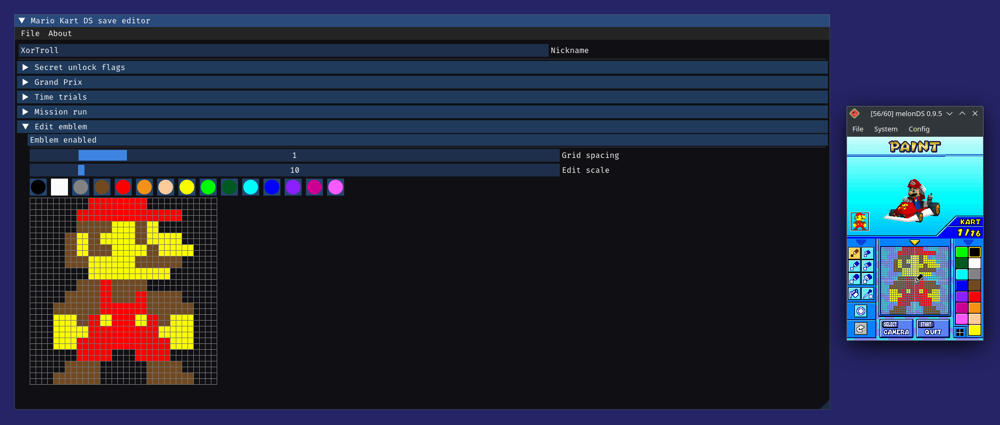
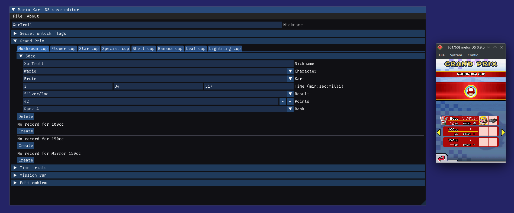

# Mario Kart DS (EU) decompilation project

> (Please keep in mind that this project is heavily work-in-progress)

- [Mario Kart DS (EU) decompilation project](#mario-kart-ds-eu-decompilation-project)
  - [Decompilation progress](#decompilation-progress)
  - [Tools (fun stuff)](#tools-fun-stuff)
    - [Save editor](#save-editor)
    - [ASM-hacking](#asm-hacking)
    - [Command-line utility](#command-line-utility)
  - [Code decompilation](#code-decompilation)
  - [Credits](#credits)

This project is working towards a decompilation of the *European version* of **Mario Kart DS** (game code `AMCP`).

While the long-term goal of this project is to 100% document and understand it, there are interesting short-term goals that motivate work on reversing this game: ASM-hacking, better understanding of yet not fully documented DS/MKDS formats, additional tools (like a save editor):

> YouTube video showcasing an ASM-hack injection of a custom scene with custom dialogs

> Screenshots of the [online save editor](https://xortroll.github.io/mkdsdecomp/)

## Decompilation progress

Progress can be tracked in some way by the generated [headers](re-export/include) and [symbols](re-export/mkds-eu-decomp-symbols.x), since all unknown types and functions are slowly being named and documented as they are better understood, and since I cannot just push my IDA database :P

## Tools (fun stuff)

While the game is not fully decompiled, we can still have some fun and get something useful from the already documented formats/code ;)

### Save editor

Reversing [save-data formats and encryption/decryption](tools/common) allowed me to create an almost fully-featured [online Mario Kart DS save editor](https://xortroll.github.io/mkdsdecomp/):

### ASM-hacking

Check out the [ASM-hacking examples](asmhack-examples) for more detailed information on how to inject custom code in MKDS, using the reversed functions/types in this project.

### Command-line utility

For practical purposes (to make my life easier) I made a simple command-line tool, [mkdsutil](tools/mkdsutil), in order to work with several MKDS formats in a more straightforward way (better than staring into a hex editor).

It currently has the following features:

- Decrypt and/or encrypt save data

- Print info/fields of decrypted save data

You will need [CMake] in order to compile it, without any external dependencies other than standard C++.

## Code decompilation

As more game logic gets fully documented, [libntr](libntr) serves as a (long-term) work-in-progress reimplementation of Nintendo's SDK code/libs, while [mkds](mkds) contains actual MKDS-specific code... as long as I'm able to tell them apart ;)

(These libraries are not really useful right now, and they might not even compile correctly as some stuff is only partially implemented)

Note that this is the long-term, low-priority part of the project, since different parts of the code are really, really dependant on each other, and thus not much can reliably be done until many parts of the game code are (almost) fully understood.

For practical uses, there are [common sources](tools/common) used by the tools in this project mentioned above.

## Credits

- [GBATEK](https://problemkaputt.de/gbatek.htm) for its great (although sometimes limited/outdated) DS docs

- [mkds-asm](https://github.com/rocoloco321/mkds-asm) containing some basic reference MKDS RE work

- [Existing MKDS decomp headers](https://github.com/HaroohiePals/MKDS-decomp-headers) for being a great reference for so many internal structs and types

- [Super Mario Wiki](https://www.mariowiki.com/Mario_Kart_DS) for allowing me to understand some basic gameplay aspects without having to spend hours playing or watching gameplay footage :P

- [Pokémon Diamond decompilation](https://github.com/pret/pokediamond) as a helpful reference for already (partially) understood DS SDK code

- [simontime's MKDS time trial code encoder](https://github.com/simontime/MKDSTTEncoder)

- ['Hacking Nintendo DS' EnHacklopedia page](https://doc.kodewerx.org/hacking_nds.html) as the only (and great) specifications I found regarding DS cheat codes

- [NCPatcher](https://github.com/TheGameratorT/NCPatcher) as a great tool for simplifying the process of making DS ASM hacks

- [Custom Mario Kart Wiiki](https://wiki.tockdom.com/wiki/Friend_Code) for providing me some understanding of WFC-related fields and data
