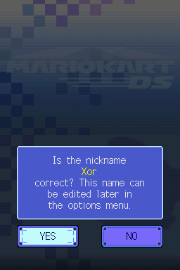
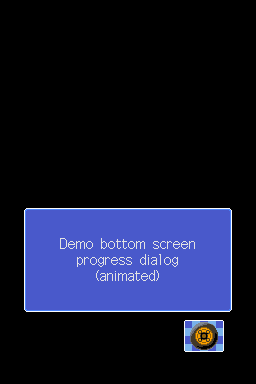
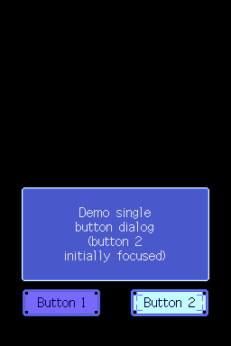
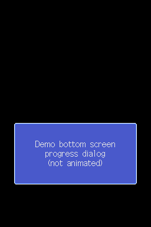
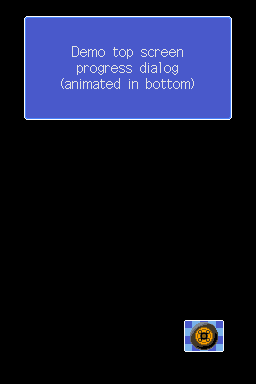
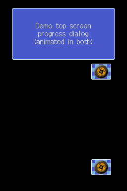

# Navigation utilities

There are a few UI navigation utilities, together managed by a global object and various global subobjects, that are used by several scenes:

## Text system (dialogs)

The so-called *text system* (name taken from the various `txt_system_*` graphics used by it) deals with displaying dialogs. These dialog system is used by `Logo`, `Result` (only when winning a gold/silver/bronze trophy), `WLMenu` (if not multi-boot), `Menu` (if multi-boot), `Menu` and `XXX` scenes.

These can be of three kinds: single-button dialogs, double-button dialogs, or progress dialogs (buttonless dialogs, essentially)

> Example navigation/dialog used by the `Nickname` scene: double-button dialog, with backscreen enabled, and with color blending enabled in both screens. The color on the player nickname comes from BMG escape formatting (TODO: write/link to that).

### Progress (buttonless) dialogs

These dialogs can be shown at the top or bottom screen (two separate functions exist, one for each case, sharing similar logic).

They can be displayed along with spinning-wheel animations (see below):

> Example progress dialog.

### Single/double-button dialogs

These dialogs can only be shown at the bottom screen.

> Example single and double button dialogs.

### Dialog parameters

The following parameters can be used to configure a dialog to be shown (can be passed to dedicated functions to create/show dialogs):

#### Caption text

UTF-16 text shown in the dialog box.

If the text is too long to fit the box, the box will just show empty (the text-printing code recognizes and split lines by `\n` terminators).

#### Button texts

UTF-16 texts for buttons (one for single-button dialogs, two for double-button dialogs).

#### Fade-in initial Y position

Boolean that controls how the fade-in procedure works. The value is treated as an index in an internal array, where `0` corresponds to a (16-bit) value of `y = 160` and `1` to a value of `y = -176`.

The dialog Y value is set a value of `y = -192` on initialization. This is done so that, regardless of this initial Y parameter, the dialog will be hidden in the first frame.

Then, the base Y position will be computed with a smooth interpolation (using trigonometric functions) from the given initial value to `y = 0`. Hence, param `0` causes the dialog to appear from the bottom screen, and param `1` causes it to appear from the top screen, having therefore two fade-in directions.
  
#### Fade-out final Y position

Boolean that controls how the fade-out procedure works. Works similar to the previous parameter, where values of `0` and `1` corresponds to the same Y positions as above.

In fade-out, the base Y position will be computed with a smooth interpolation (using trigonometric functions) from `y = 0` to the final Y value. Hence, the effect is the same as above, but with opposite directions (the same value for both fade-in and fade-out will cause the dialog to fade out in reverse as it faded in, essentially "returning to its original place").

#### Progress animation flags (top/sub screen)

Booleans that indicate whether to show and animate the spinning-wheel animation (only usable in progress dialogs, per the exposed function arguments). 
 
Bottom-screen progress dialogs only can customize the bottom screen animation, while top screen ones can customize both:

#### Initially selected button

For double button dialogs, a boolean is required (in the dedicated functions) to specify whether the first button (`0`) or the second button (`1`) is initially focused.

> All possible combinations of progress dialog animations

- **Blend flags (top/sub screen)**: booleans that indicate whether to blend colors in the respective screen. This effect is not appreciated unless the backscreen is enabled in the navigation:

> All possible dialog/screen blending combinations

Appart from these, there are exposed functions to set the following fields:

- Which input to use (TODO: detail this a bit more?)

- Some yet-unknown, graphics-related values (TODO)

- Single/left button press SSEQ ID of SARC `0` (default: `5`)

- Right button press SSEQ ID of SARC `0` (default: `16`)

  > TODO: all these above two do not appear to be used at all...? Are they used in some overlay perhaps?

- Dialog fade-in SSEQ ID of SARC `0` (default: `35`)

  - For example, used when unlocking something (as a "special" dialog, with a different jingle)

When initializing the text system, the following fields can be set:

- The dialog font (TODO: page about fonts).

- Flags regarding which sprites should be loaded

  - All usages of these flags always set them in the same way, and disabling some of them will just show no dialog at all.

### Dialog logic

The dialog jumps between different states:

- State `0` (initial state):

  - Performs initial dialog loading, if needed (a flag encodes that), then jumps to state `1`
  - Otherwise, does nothing (happens when the dialog is closed)
  > By this point, the code using the dialog will finally check the player input (if needed, for single-button dialogs can be obviously ignored) and continue with its own logic.

- State `1`:

  - Shows fade-in animation, then jumps to state `2`

- State `2`:

  - If closing was requested (checks corresponding flag) jumps to state `4`
  - Performs input checking
    - Button bounds for (single and double cases) are hardcoded, performs bounds checking against touch position
    - If LEFT/RIGHT button movement was done, plays corresponding SSEQ ID (see above) and updates button graphics.
    - If a button was pressed (via A/touch): corresponding SSEQ ID (see above) and jumps to state `3`
  - Thus, the dialog will stay in this state until any input is received by the player

- State `3`:

  - Shows button press animation
  - Sets a flag indicating that a button was pressed, then jumps again to `2`
  > Note: by this point, the code using the dialog should check that this flag was set (using the dedicated function for it), and "acknowledge" that the player selected a button by requesting to close the dialog (also using a dedicated function) (see above).

- State `4`:

  - Shows fade-out animation, then jumps to `0` (the dialog finishes)
